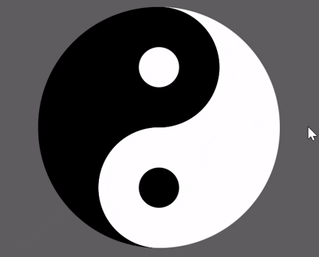

# ☯ Interactive Yin-Yang

A smooth, animated Yin-Yang symbol built entirely with HTML + CSS — no JavaScript required.
On hover, the colors invert in a satisfying transition, giving you a calm little moment of Zen.

# Features

Pure HTML & CSS — no dependencies, no fuss.

Smooth hover transitions (0.5s ease-in-out).

Fully responsive center alignment using Flexbox.

Minimal & clean code that you can easily customize.

# Preview

# Inspiration

This project was made just for fun to play with CSS shapes, borders, and transitions.
It’s a tiny visual reminder of balance — right inside your browser.
